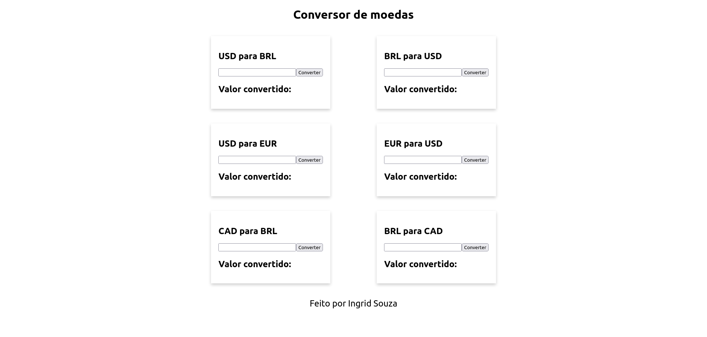

# Conversor de moedas

Site conversor de moedas, feito com React, o intuito foi práticar o uso de componentes com classes, props, setState e o uso de componentes com functions com o useState.

This project was bootstrapped with [Create React App](https://github.com/facebook/create-react-app).

## Table of contents

- [Screenshot](#screenshot)
- [Links](#links)
- [Author](#author)

## Screenshot

## Links

- Solution URL: [Solution here](https://github.com/IngridsSilveira/conversor_moedas_react)

## Linguagem

<strong>Desenvolvido com:</strong>

<ul>
        <li>React</li>
        <li>Componentes React, Classes e useState</li>
        <li>CSS</li>
</ul>

## Author

- Website - [Ingrid Souza](https://ingriddev.netlify.app/)
- GitHub - [@IngridsSilveira](https://github.com/IngridsSilveira)

